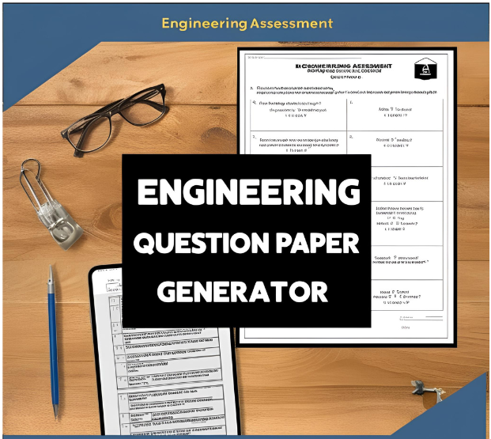

# Blooms-VLITS

An educational NLP system for classifying engineering questions using a fine-tuned BERT model and generating exam question papers based on Bloom's Taxonomy distributions.

[Live Demo](https://blooms-vlits-j8aodkrrjddn939dz94ajy.streamlit.app/) • [Research Paper](./Research%20Paper.pdf)



## Overview

Blooms-VLITS is designed to support assessment planning in academic settings by automating the classification of questions according to the Revised Bloom's Taxonomy. Instead of manually tagging each question, the system uses a fine-tuned transformer model to label it as one of six cognitive levels:

- Remember
- Understand
- Apply
- Analyze
- Evaluate
- Create

Once questions are classified, the application helps instructors generate balanced question papers by selecting a target distribution across Bloom levels and producing an exam document from a CSV dataset.

## Problem Statement

In many educational workflows, question design is still a manual, time-consuming task. Faculty members often need to ensure that exam questions align with learning outcomes, cognitive difficulty, and Bloom-level coverage. This becomes difficult when large question banks are involved and the distribution must be balanced across multiple cognitive levels.

## Solution

Blooms-VLITS provides a complete workflow that:

1. ingests question data from CSV files
2. classifies each question using a BERT-based model
3. stores and manages the dataset
4. lets admins upload or edit questions
5. allows students or faculty to configure Bloom-level distributions
6. generates a structured question paper document automatically

## Key Features

- BERT-based Bloom's Taxonomy classification
- CSV questionnaire upload and processing
- Admin dashboard for dataset management
- Student/user dashboard for question paper generation
- Authentication and role-based access
- Bloom distribution-based question selection
- Auto-generated `.docx` question papers
- Research paper included in the repository
- Streamlit web application for easy deployment and demo use

## How It Works

```text
Input Questions
      ↓
CSV Processing / Question Upload
      ↓
BERT-based Classification Model
      ↓
Bloom's Taxonomy Labeling
      ↓
Configured Bloom-Level Distribution
      ↓
Question Paper Generation
      ↓
Generated Exam Document
```

The workflow is implemented across multiple modules, including dataset management, classification, authentication, dashboards, and paper generation.

## Tech Stack

### Frontend / App UI
- Streamlit
- Python

### NLP / ML
- BERT
- Hugging Face Transformers
- PyTorch

### Data and Processing
- pandas
- CSV-based question datasets
- python-docx for generated exam output

### Authentication / Local Storage
- SQLite database
- bcrypt password hashing

## Project Structure

```text
Blooms-VLITS/
├── admin_dashboard.py
├── app.py
├── auth.py
├── classifier.py
├── dataset/
│   └── total.csv
├── generated_papers/
├── generate_paper.py
├── inference.py
├── main.py
├── process_upload.py
├── README.md
├── requirements.txt
├── Research Paper.pdf
├── Screenshot 2025-07-07 215333.png
├── test_model.py
├── train_model.py
├── uploads/
├── user_dashboard.py
├── vignan.png
├── LICENSE
├── .gitignore
└── new_database.db   # created locally during runtime
```

## Installation & Setup

### 1. Clone the repository

```bash
git clone https://github.com/Bokka-kartik/Blooms-VLITS.git
cd Blooms-VLITS
```

### 2. Create a virtual environment

```bash
python -m venv venv
```

On Windows:

```bash
venv\Scripts\activate
```

On macOS/Linux:

```bash
source venv/bin/activate
```

### 3. Install dependencies

```bash
pip install -r requirements.txt
```

## Model Setup

This project depends on a locally trained model directory named:

```text
fine_tuned_bert_bloom_taxonomy
```

The repository does not include the trained model checkpoint because it is large. You must download it from the provided Google Drive link and place it in the project directory in the expected folder structure before running the classification pipeline.

> The model file is intentionally external because the trained checkpoint is too large to be stored directly in the Git repository.

### Example structure

```text
Blooms-VLITS/
├── fine_tuned_bert_bloom_taxonomy/
│   ├── config.json
│   ├── tokenizer_config.json
│   ├── vocab.txt
│   ├── model.safetensors
│   └── ...
```

Google Drive link:

[Download model checkpoint](https://drive.google.com/drive/folders/1-gOBLCihfu37dRkehKQCXRUwhLKZRuyH?usp=sharing)

## Running the Application

Start the app from the project root:

```bash
streamlit run main.py
```

The login page will load first. Users can register or log in as an admin or a normal user.

## Using the Application

### Admin workflow
- upload CSV datasets
- review or manage question entries
- maintain subject-specific question banks
- track uploads and generated content

### User workflow
- select a subject dataset
- configure Bloom-level distribution
- generate a question paper
- download or review the generated exam document

## Demo

A live demo of the application is available here:

[Streamlit Live Demo](https://blooms-vlits-j8aodkrrjddn939dz94ajy.streamlit.app/)

## Research

This project is associated with a research paper included in the repository:

[Research Paper](./Research%20Paper.pdf)

The paper documents the motivation, methodology, and educational focus behind using NLP and Bloom's taxonomy for automated assessment support.

## Future Improvements

- add a more robust model training pipeline with validation metrics
- integrate a larger and more diverse question dataset
- improve UI/UX for admins and faculty users
- add PDF export and better document formatting
- add REST API support for integration with other education platforms
- provide automatic dataset cleaning and labeling workflows

## License

This project is licensed under the Apache License 2.0.

See [LICENSE](LICENSE) for details.

## Contributions

Pull requests and issues are welcome. Contributions that improve the NLP workflow, question generation logic, or usability are encouraged.


